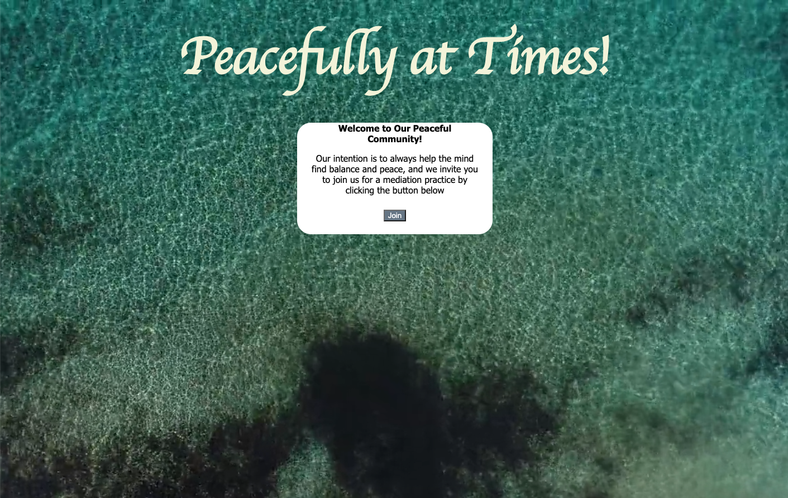
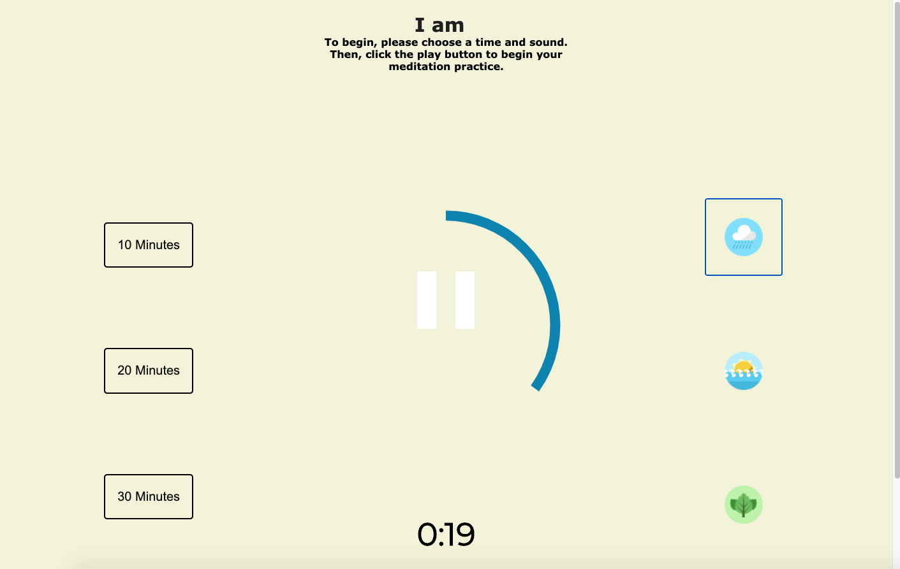
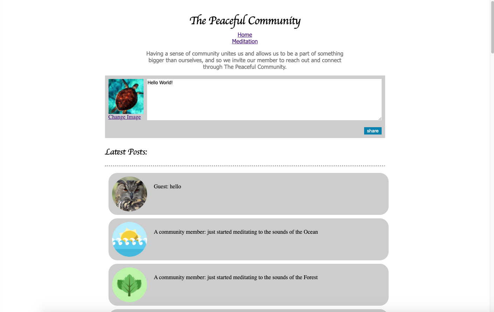

# **Peacefully All the Time**

## Table of Contents
- About the Project
- Screenshots
- Built With
- Developers
- Acknowledgements

## About the Project

The burden of mental illness is among one the highest of all diseases, with approximately 1 in 4 adults experiencing a mental health disorder in the past year. A sense of community and spending time in nature have been proven to help your metal wellbeing, and with the chaos brought on by the pandemic, peace of mind is more important than ever. But as states and citizens quarantine, it becomes harder to access both community and nature – especially for those living in cities.

With that in mind we created Peacefully at Times, a web app designed to help you unwind and connect with others. 

Our home page is peaceful and serene, a design esthectic we choose to carry throughout the project to help quiet the mind. After clicking on the join button, you will be brought to the meditation page where you are greeted with affirmations and given a choice of meditation offerings. 

Visitors can select 10, 20, or 30 minutes as the duration of their meditation session, and the nature sounds that they would like to hear – with the choice of rain, ocean, and forest sounds. The sounds will play, and the svg animation will fill around the play/pause button, until the timer runs out. You can also pause the music and timer by pressing the pause button at any time during the meditation.

After meditating, users can visit our community page. Here the message board will feature notifications when other meditators start a session, so that they know that even though they are physically separated, they are still together in spirit. Users can also post a message, and change the images associated with their post to reflect their spirit animal. 

Peacefully All the Time was created as a group front-end project for DigitalCraft's September 2020 Cohort.

## Screenshots

- Welcome Page: 

-

- Meditation Page: 

-

- Community Page: 

-

## Build With
- HTML
- CSS
- JavaScript
- Firebase Firestore

## Developers
- Katy Donoghue - [kjdonoghue] (https://github.com/kjdonoghue) 
- Juan Trinidad - [juantrinidad] (https://github.com/juantrinidad14)
- Thomas McGuire - [Tmac58] (https://github.com/Tmac58)
- Adebowale Oduwole

## Acknowledgements
- Nathan Orris - The Certified Awesome- DiR at DigitalCrafts Houston - [NathanNoSudo] (https://github.com/NathanNOSudo)
